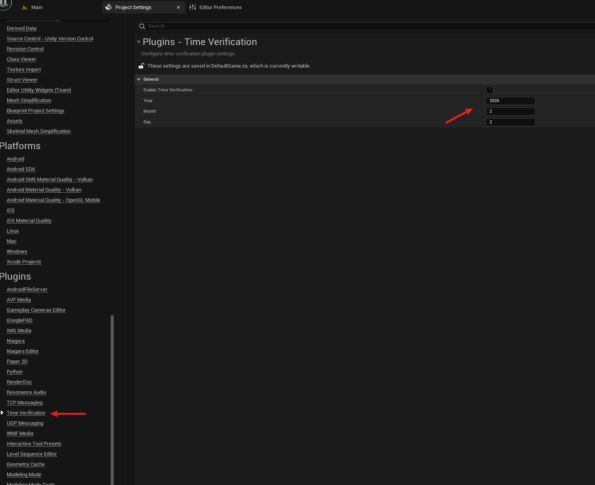
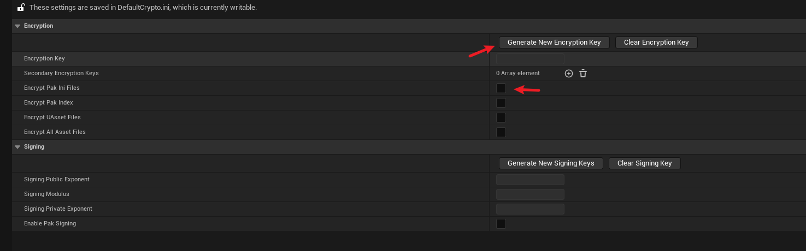

# TimeVerificationPlugin
---
## 功能
- 用于简单的虚幻引擎打包后的时间验证
- 基于基础的离线本地时间认证
- 通过一些其他手段防止用户直接修改本地时间

---
~~部分代码使用AI生成,勿喷.~~

基于5.4版本虚幻引擎,插件已测试通过.5.7版本也有测试通过.
其他版本可自行编译.
---
## 如何编译
1. 将插件放入项目的Plugins目录下
2. 在项目设置中启用插件(一般为默认启用)
3. 右键选择".uproject"文件,然后点击"Generate Visual Studio project files"(这么做会刷新项目的sln文件)
4. 双击项目的sln文件,打开Visual Studio,然后重新生成即可

## 如何使用
1. 选择"Edit"->"Plugins Settings"
2. 在插件设置中找到"TimeVerificationPlugin"部分(位于左侧滚动框最下方,"Plugins"分类下)
3. 在右侧找到"Enable Time Verification"选项,将其勾选上
4. 下方的"Year""Month""Day"分别对应打包后验证时间
   
5. 选择"Project"->"Encryption",然后选择"Generate New Encryption Key",生成新的加密密钥
6. 选择"Encrypt Pak Ini Files"选项,将其勾选上

---
## 注意事项
1. 插件仅在打包后的版本中生效,在编辑器中不会生效
2. ...

---
